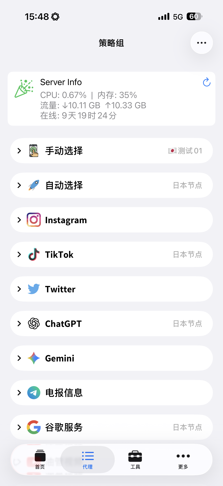

# Marius - 个人代理规则库

本仓库用于存放个人使用的 Surge / Quantumult X 模块、规则及脚本。

## 📸 VPS 监控面板效果预览

<p align="center">
  
</p>

<p align="center">
  基于 Docker + Surge Panel 的轻量级 VPS 监控方案
</p>

---

# 🚀 VPS 极客监控面板

本仓库内置了一套基于 **Go 后端 + Docker + Surge Panel** 的轻量级原生服务器指标监控方案。

### ✨ 项目特点

- 无需数据库
- 无需 Docker Socket 权限
- 无需额外 Agent
- 基于 Linux 原生 `/proc` 数据源
- Docker 一键部署
- 支持 Surge 图形化参数配置
- 支持多服务器部署
- 资源占用极低

---

## 1. 服务端部署（VPS）

在 Linux 服务器上新建目录（推荐 `/opt/1panel/apps/secure-monitor`），创建 `docker-compose.yml` 文件并写入以下配置：

```yaml
services:
  secure-monitor:
    image: hk2fs/secure-monitor:v2.0
    container_name: secure-monitor
    restart: always

    network_mode: host
    read_only: true

    security_opt:
      - no-new-privileges:true

    environment:
      - API_KEY=your-random-api-key
      - PORT=40728 # 可自定义监听端口

    volumes:
      - /proc:/host/proc:ro
      - /sys:/host/sys:ro
```

### 启动服务

```bash
docker compose up -d
```

### 生成随机 API Key（推荐）

```bash
openssl rand -hex 32
```

示例输出：

```text
0aa46df18f2cc9574cad054a931209af0e5b0c7e33f4d3d0d7c8a9f3e6b1c2d4
```

将生成的随机字符串填入 Docker Compose 配置中的 `API_KEY`，并在 Surge 模块参数中填写相同的值即可完成认证。

`PORT` 可根据实际需求修改，但需确保：

- Surge 模块中的后端地址同步修改
- 服务器安全组放行对应端口
- 本机防火墙允许对应端口访问

💡 启动后请记得在云服务器控制台（安全组 / 防火墙）中放行对应 TCP 端口。

---

## 2. 客户端配置（Surge）

本仓库的 `vps_monitor.sgmodule` 已适配 Surge 参数配置功能，支持图形化修改。

### 安装步骤

1. 打开 Surge
2. 进入 **模块（Modules）**
3. 点击 **安装新模块**
4. 导入以下链接：

```text
https://raw.githubusercontent.com/vplkos/jovery/main/modules/vps_monitor.sgmodule
```

5. 安装完成后，点击模块右侧 **···**
6. 选择 **编辑参数**

填写以下内容：

| 参数 | 说明 |
|--------|--------|
| 后端地址 | 服务器 IP 与端口 |
| 鉴权密钥 | Docker 配置中的 API_KEY |
| 面板标题 | 自定义服务器名称 |
| 面板图标 | SF Symbols 图标名称 |
| 刷新间隔 | 建议 15～30 秒 |

配置保存并重载后，即可在 Surge 首页查看服务器实时状态。

---

## 📊 监控指标

当前支持以下监控项目：

- CPU 使用率
- 内存使用率
- 网络总流量
- 系统运行时间

所有数据均直接读取 Linux 宿主机内核接口，不依赖 Docker API、SNMP 或第三方监控 Agent。

<details>
<summary>🔬 实现原理</summary>

### 数据来源

- CPU：`/proc/stat`
- 内存：`/proc/meminfo`
- 网络流量：`/proc/net/dev`
- 运行时间：`/proc/uptime`

### 计算方式

- CPU：基于 `/proc/stat` 差分采样计算
- 内存：基于 `MemAvailable` 计算真实内存占用率
- 网络流量：汇总所有非回环网卡流量
- 运行时间：读取系统启动时间

项目采用 Go 原生实现，无需数据库、无需 Docker Socket、无需额外 Agent。

</details>

---

## 📦 资源索引

### 📱 模块（Modules）

| 功能 | 资源链接 |
| :--- | :--- |
| Busuu | https://raw.githubusercontent.com/vplkos/jovery/main/modules/busuu.sgmodule |
| VPS 监控面板 | https://raw.githubusercontent.com/vplkos/jovery/main/modules/vps_monitor.sgmodule |

### 🌐 规则（Rules）

| 功能 | 资源链接 |
| :--- | :--- |
| 众安银行（ZA Bank） | https://raw.githubusercontent.com/vplkos/jovery/main/rules/za-bank.list |
| Homebrew | https://raw.githubusercontent.com/vplkos/jovery/main/rules/homebrew.list |

### 🛠 脚本（Scripts）

| 功能 | 资源链接 |
| :--- | :--- |
| Busuu脚本 | https://raw.githubusercontent.com/vplkos/jovery/main/scripts/busuu.js |
| VPS面板解析脚本 | https://raw.githubusercontent.com/vplkos/jovery/main/scripts/vps_panel.js |

---

## 说明

- 本仓库内容仅供学习与交流使用。
- 若规则、脚本或模块失效，请检查仓库是否已有更新。
